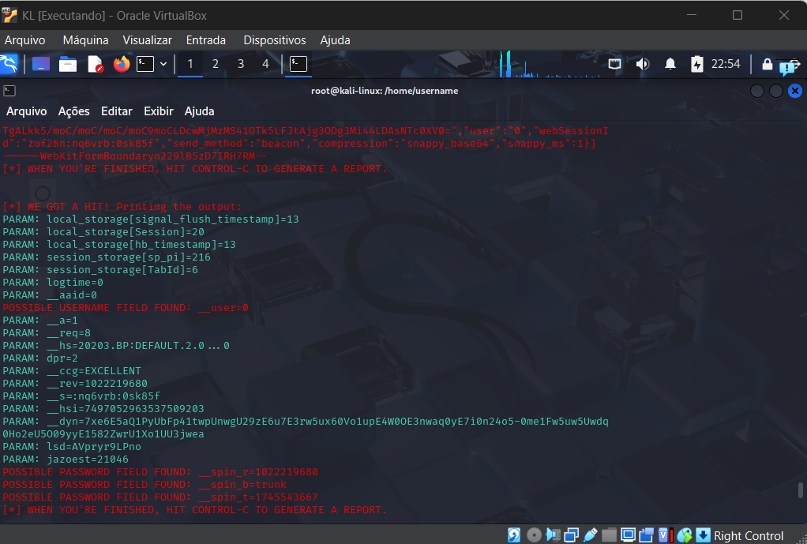

# Configurando um Phishing para captura de senhas do Facebook

### Links utilizados
- Kali Linux: https://www.kali.org/get-kali/#kali-installer-images

### Habilidades Trabalhadas
- Configuração de VMs
- conhecimentos basicos de rede

### Ferramentas utilizadas:
- Virtualbox
- Kali Linux
- setoolkit

### Configurando o Phishing no Kali Linux

- Acessar privilegio usuario root: --- sudo su ---
- Iniciando o serviço setoolkit: --- setoolkit ---
- Tipo de ataque: --- Social-Engineering Attacks ---
- Vetor de ataque: --- Web Site Attack Vectors ---
- Método de ataque: --- Credential Harvester Attack Method ---
- Método de ataque: --- Site Cloner ---
- Obtendo o endereço da máquina: --- ifconfig ---
- URL para clonagem: http://www.facebook.com

### Resutados

